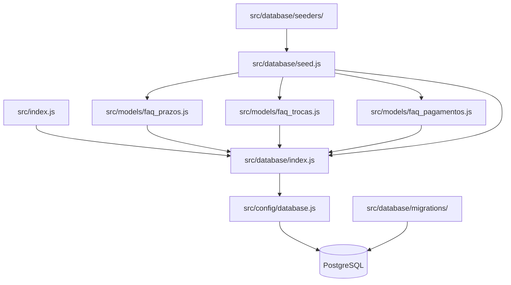

# Design Document — database-setup

## Overview

Esta feature configura a camada de persistência do SupportBot da TechStore usando Sequelize ORM com PostgreSQL. O objetivo é criar os modelos das três tabelas de FAQ (`faqPrazos`, `faqTrocas`, `faqPagamentos`), as migrações que criam o schema no banco e os seeds que populam os dados iniciais — tudo de forma reproduzível e idempotente.

A abordagem segue o padrão migration-first: o schema nunca é criado via `sync()`, garantindo rastreabilidade e segurança em qualquer ambiente (dev, staging, produção).

## Architecture



Fluxo de inicialização:
1. `src/index.js` carrega `.env` e inicia o servidor
2. `src/database/index.js` cria a instância Sequelize compartilhada
3. Os models importam essa instância e se registram
4. Migrações criam o schema via `sequelize-cli`
5. `seed.js` popula os dados via `bulkCreate`

## Components and Interfaces

### `src/config/database.js` (já existe)

Exporta o objeto de configuração lido de variáveis de ambiente. Nenhuma alteração necessária.

```js
module.exports = {
  host: process.env.DB_HOST,
  port: process.env.DB_PORT,
  database: process.env.DB_NAME,
  username: process.env.DB_USER,
  password: process.env.DB_PASSWORD,
  dialect: 'postgres',
};
```

### `src/database/index.js` (já existe)

Instância Sequelize compartilhada. Nenhuma alteração necessária.

### `src/models/faq_prazos.js`

Model Sequelize para a tabela `faqPrazos`.

Interface:
- `FaqPrazos.findAll()` — retorna todos os registros
- `FaqPrazos.bulkCreate(data, options)` — inserção em lote

### `src/models/faq_trocas.js`

Model Sequelize para a tabela `faqTrocas`. Mesma interface que `FaqPrazos`.

### `src/models/faq_pagamentos.js`

Model Sequelize para a tabela `faqPagamentos`. Mesma interface que `FaqPrazos`.

### `src/database/seeders/faq_prazos_seeder.js`

Módulo que exporta o array de FAQ_Entries para `faqPrazos` (≥ 3 entradas).

### `src/database/seeders/faq_trocas_seeder.js`

Módulo que exporta o array de FAQ_Entries para `faqTrocas` (≥ 3 entradas).

### `src/database/seeders/faq_pagamentos_seeder.js`

Módulo que exporta o array de FAQ_Entries para `faqPagamentos` (≥ 3 entradas).

### `src/database/seed.js`

Script executável que orquestra os seeds em sequência:
1. Importa os três models e os três seeders
2. Executa `bulkCreate` com `ignoreDuplicates: true` para cada tabela
3. Loga confirmação por tabela
4. Fecha a conexão ao final
5. Em caso de erro: loga e chama `process.exit(1)`

### Migrações (`src/database/migrations/`)

Três arquivos de migração, um por tabela:
- `YYYYMMDDHHMMSS-create-faq-prazos.js`
- `YYYYMMDDHHMMSS-create-faq-trocas.js`
- `YYYYMMDDHHMMSS-create-faq-pagamentos.js`

Cada migração implementa `up` (createTable) e `down` (dropTable).

### `.sequelizerc`

Arquivo de configuração na raiz do projeto apontando os diretórios corretos para o `sequelize-cli`.

## Data Models

### FAQ_Entry (estrutura comum às três tabelas)

| Campo     | Tipo    | Constraints              |
|-----------|---------|--------------------------|
| id        | INTEGER | PRIMARY KEY, AUTO INCREMENT |
| pergunta  | STRING  | NOT NULL                 |
| resposta  | TEXT    | NOT NULL                 |

Opções do model Sequelize:
- `timestamps: false` — sem `createdAt`/`updatedAt`
- `tableName` explícito para cada model (`faqPrazos`, `faqTrocas`, `faqPagamentos`)

### Exemplo de definição de model

```js
const { DataTypes } = require('sequelize');
const sequelize = require('../database');

const FaqPrazos = sequelize.define('FaqPrazos', {
  pergunta: { type: DataTypes.STRING, allowNull: false },
  resposta:  { type: DataTypes.TEXT,   allowNull: false },
}, {
  tableName: 'faqPrazos',
  timestamps: false,
});

module.exports = FaqPrazos;
```

### Exemplo de migração

```js
'use strict';
module.exports = {
  async up(queryInterface, Sequelize) {
    await queryInterface.createTable('faqPrazos', {
      id:       { type: Sequelize.INTEGER, primaryKey: true, autoIncrement: true },
      pergunta: { type: Sequelize.STRING,  allowNull: false },
      resposta: { type: Sequelize.TEXT,    allowNull: false },
    });
  },
  async down(queryInterface) {
    await queryInterface.dropTable('faqPrazos');
  },
};
```

### `.sequelizerc`

```js
const path = require('path');
module.exports = {
  'config':          path.resolve('src/config', 'database.js'),
  'models-path':     path.resolve('src', 'models'),
  'seeders-path':    path.resolve('src/database', 'seeders'),
  'migrations-path': path.resolve('src/database', 'migrations'),
};
```

## Error Handling

| Cenário | Comportamento |
|---|---|
| Conexão com PostgreSQL falha na inicialização | `sequelize.authenticate()` rejeita com erro descritivo; a aplicação não sobe |
| `bulkCreate` falha em qualquer tabela no seed | `seed.js` captura o erro, loga via `console.error` e chama `process.exit(1)` |
| Migração já executada | `sequelize-cli` ignora nativamente via tabela `SequelizeMeta` |
| Seed executado mais de uma vez | `ignoreDuplicates: true` previne erro de constraint duplicada |
| Variável de ambiente ausente | A conexão falha com erro do driver `pg` indicando o campo faltante |

## Testing Strategy

Esta feature é composta inteiramente de configuração de infraestrutura, definição de schema e scripts de setup. Não há lógica de transformação pura com espaço de entrada variável que justifique property-based testing. A estratégia de testes usa exclusivamente testes unitários com mocks e smoke tests.

**Por que PBT não se aplica:** todos os critérios de aceitação são verificações estáticas de configuração (SMOKE), verificações de comportamento binário (EXAMPLE) ou dependências de serviços externos (INTEGRATION). Nenhum critério envolve uma função pura cujo comportamento varie significativamente com entradas aleatórias.

### Testes Unitários (com mocks)

Cobrir os seguintes cenários com Jest:

**Models (`src/models/`)**
- Cada model define `pergunta` como STRING NOT NULL
- Cada model define `resposta` como TEXT NOT NULL
- Cada model tem `timestamps: false`
- Cada model usa a instância Sequelize compartilhada (`model.sequelize === sequelize`)
- Cada model aponta para o `tableName` correto

**Seed script (`src/database/seed.js`)**
- `bulkCreate` é chamado uma vez por tabela com o array de dados correto
- `bulkCreate` é chamado com `{ ignoreDuplicates: true }`
- Seeds executam na ordem: `faqPrazos` → `faqTrocas` → `faqPagamentos`
- `console.log` é chamado após cada tabela populada com sucesso
- Quando `bulkCreate` rejeita: `console.error` é chamado e `process.exit(1)` é invocado
- `sequelize.close()` é chamado ao final (sucesso ou falha)

**Seeders (`src/database/seeders/`)**
- Cada seeder exporta um array com ao menos 3 entradas
- Cada entrada contém `pergunta` (string não vazia) e `resposta` (string não vazia)

**Config (`src/config/database.js`)**
- `dialect` é `'postgres'`
- Os campos `host`, `port`, `database`, `username`, `password` são lidos de `process.env`

### Smoke Tests / Verificações Estruturais

- `.sequelizerc` existe na raiz e aponta os diretórios corretos
- Arquivos de migração existem para as três tabelas
- Cada migração implementa `up` e `down`
- `src/database/seed.js` existe e é um módulo Node.js válido

### Testes de Integração (opcionais, requerem banco real)

- `npx sequelize-cli db:migrate` executa sem erro
- `npx sequelize-cli db:migrate` executado duas vezes não gera erro (idempotência)
- `node src/database/seed.js` popula as três tabelas
- `node src/database/seed.js` executado duas vezes não gera erro (idempotência via `ignoreDuplicates`)
