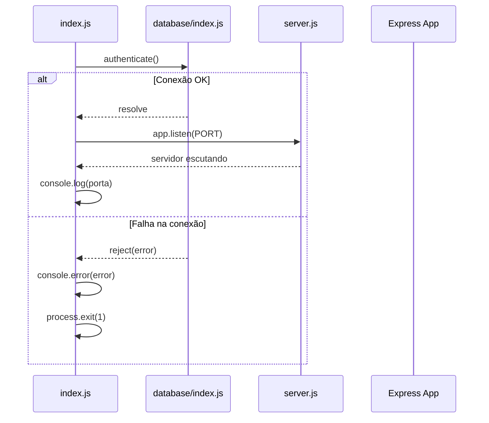

# Design Document — server-setup

## Overview

Este documento descreve o design técnico para a inicialização do servidor Express do SupportBot da TechStore. A solução separa a configuração do servidor (`server.js`) do ponto de entrada (`index.js`), garantindo testabilidade independente e inicialização ordenada: verificação da conexão com o banco de dados antes de aceitar requisições HTTP.

A stack utilizada é Node.js v22.22.1, Express, Sequelize ORM e PostgreSQL v18. Todas as configurações são carregadas via variáveis de ambiente.

---

## Architecture

O fluxo de inicialização segue esta sequência:



Estrutura de arquivos envolvidos:

```
src/
├── config/
│   └── database.js        # Configuração do Sequelize (host, port, db, user, password)
├── database/
│   └── index.js           # Instância do Sequelize exportada
├── middlewares/
│   └── error_handler.js   # Middleware centralizado de erros
├── routers/
│   └── index.js           # Agregador de rotas sob /api
├── server.js              # App Express configurado (middlewares + rotas)
└── index.js               # Ponto de entrada (DB auth → listen)
```

---

## Components and Interfaces

### `src/config/database.js`

Exporta um objeto de configuração carregado das variáveis de ambiente.

```js
// Exporta:
{
  host: process.env.DB_HOST,
  port: process.env.DB_PORT,
  database: process.env.DB_NAME,
  username: process.env.DB_USER,
  password: process.env.DB_PASSWORD,
  dialect: 'postgres'
}
```

### `src/database/index.js`

Exporta a instância única do Sequelize configurada com `src/config/database.js`.

```js
// Exporta: instância de Sequelize
const sequelize = new Sequelize(config.database, config.username, config.password, config)
module.exports = sequelize
```

### `src/server.js`

Cria e configura o app Express. Registra middlewares e rotas. Exporta o app para uso em `index.js` e em testes.

Interface exportada:
```js
module.exports = app  // Express Application
```

Responsabilidades:
- Aplicar `express.json()`, `express.urlencoded({ extended: true })`, `cors(corsOptions)`, `helmet()`
- Registrar rotas sob `/api` via `src/routers/index.js`
- Registrar handler 404 após as rotas
- Registrar `error_handler` como último middleware

### `src/middlewares/error_handler.js`

Middleware de 4 parâmetros `(err, req, res, next)`. Retorna JSON padronizado.

```js
// Resposta em desenvolvimento:
{ message, status, stack }

// Resposta em produção:
{ message, status }
```

### `src/routers/index.js`

Agrega os routers de domínio e os monta sob `/api`. Cada router de domínio é um `express.Router()` independente.

### `src/index.js`

Ponto de entrada. Executa `authenticate()` e, em caso de sucesso, chama `app.listen()`.

---

## Data Models

Esta feature não define modelos de dados de negócio. O único "modelo" relevante é o objeto de configuração do Sequelize:

| Campo      | Variável de Ambiente | Padrão   |
|------------|----------------------|----------|
| `host`     | `DB_HOST`            | —        |
| `port`     | `DB_PORT`            | —        |
| `database` | `DB_NAME`            | —        |
| `username` | `DB_USER`            | —        |
| `password` | `DB_PASSWORD`        | —        |
| `dialect`  | —                    | `postgres` |

Variáveis de ambiente adicionais:

| Variável      | Uso                        | Padrão        |
|---------------|----------------------------|---------------|
| `PORT`        | Porta do servidor HTTP     | `3000`        |
| `CORS_ORIGIN` | Origem permitida pelo CORS | `*` (qualquer)|
| `NODE_ENV`    | Ambiente de execução       | —             |


---

## Correctness Properties

*A property is a characteristic or behavior that should hold true across all valid executions of a system — essentially, a formal statement about what the system should do. Properties serve as the bridge between human-readable specifications and machine-verifiable correctness guarantees.*

### Property 1: CORS origin reflete a variável de ambiente

*For any* valor de `CORS_ORIGIN` definido no ambiente, uma requisição HTTP com o header `Origin` correspondente deve receber na resposta o header `Access-Control-Allow-Origin` com esse mesmo valor. Quando `CORS_ORIGIN` não estiver definida, qualquer origem deve ser permitida.

**Validates: Requirements 2.3, 2.4**

---

### Property 2: Rotas não registradas retornam 404 com JSON

*For any* path HTTP que não corresponda a uma rota registrada no app, a resposta deve ter status `404` e um corpo JSON contendo a chave `message`.

**Validates: Requirements 3.3**

---

### Property 3: Error handler retorna JSON padronizado com message e status

*For any* objeto de erro passado via `next(error)`, o middleware de tratamento de erros deve retornar uma resposta JSON contendo as chaves `message` e `status`. Quando o erro não possuir `status` definido, o status HTTP da resposta deve ser `500`.

**Validates: Requirements 4.2, 4.3**

---

### Property 4: Stack de erro presente fora de production, ausente em production

*For any* objeto de erro, quando `NODE_ENV` for diferente de `production`, a resposta JSON deve incluir a propriedade `stack`. Quando `NODE_ENV` for `production`, a propriedade `stack` não deve estar presente na resposta.

**Validates: Requirements 4.4, 4.5**

---

### Property 5: Config do banco reflete as variáveis de ambiente

*For any* conjunto de valores atribuídos às variáveis `DB_HOST`, `DB_PORT`, `DB_NAME`, `DB_USER` e `DB_PASSWORD`, o objeto exportado por `src/config/database.js` deve conter exatamente esses valores nos campos correspondentes, além de `dialect: 'postgres'`.

**Validates: Requirements 5.1, 5.5**

---

## Error Handling

### Erros de conexão com o banco de dados

- `index.js` captura a rejeição de `authenticate()` via `catch`
- Registra o erro com `console.error`
- Encerra o processo com `process.exit(1)` para evitar que o servidor suba sem banco disponível

### Erros em rotas e middlewares

- Qualquer erro passado via `next(error)` é capturado pelo `error_handler`
- Erros sem `status` recebem `500` por padrão
- Em desenvolvimento, `stack` é incluído para facilitar diagnóstico
- Em produção, `stack` é omitido para não expor detalhes internos

### Rotas não encontradas

- Um middleware 404 é registrado após todas as rotas
- Retorna `{ message: 'Rota não encontrada' }` com status `404`
- Não passa para o `error_handler` — é uma resposta direta

---

## Testing Strategy

Esta feature envolve configuração de servidor, middlewares e inicialização — não há funções puras de transformação de dados. A maior parte dos testes será baseada em exemplos e integração leve (supertest). Property-based testing é aplicável para os casos onde o comportamento varia com inputs (CORS origin, error handler, config de banco).

### Biblioteca de PBT

Usar **fast-check** (JavaScript) para os testes de propriedade. Mínimo de 100 iterações por propriedade.

### Testes unitários (exemplo-based)

| Arquivo de teste | O que cobre |
|---|---|
| `test_server.js` | App exportado é instância Express; middlewares registrados (json, urlencoded, helmet) |
| `test_index.js` | listen chamado com PORT correta; fallback para 3000; console.log após listen; authenticate antes de listen; process.exit(1) em falha de DB |
| `test_error_handler.js` | Exemplos concretos de erros com e sem status |
| `test_routers.js` | Router exporta express.Router(); rotas montadas sob /api |

### Testes de propriedade (fast-check)

Cada teste deve ter no mínimo 100 iterações e incluir um comentário de rastreabilidade:

```
// Feature: server-setup, Property N: <texto da propriedade>
```

| Propriedade | Arquivo | Gerador |
|---|---|---|
| Property 1: CORS origin | `test_server.js` | `fc.webUrl()` ou `fc.string()` para origens |
| Property 2: 404 para rotas não registradas | `test_server.js` | `fc.string()` para paths aleatórios |
| Property 3: Error handler JSON padronizado | `test_error_handler.js` | `fc.record({ message: fc.string(), status: fc.option(fc.integer()) })` |
| Property 4: Stack por ambiente | `test_error_handler.js` | `fc.record({ message: fc.string() })` com NODE_ENV variando |
| Property 5: Config reflete env vars | `test_config.js` | `fc.record({ host, port, name, user, password: fc.string() })` |

### Cobertura mínima

- Caminho feliz: servidor sobe, middlewares respondem, rotas funcionam
- Caminho de erro: falha de DB encerra processo; erros em rotas retornam JSON padronizado
