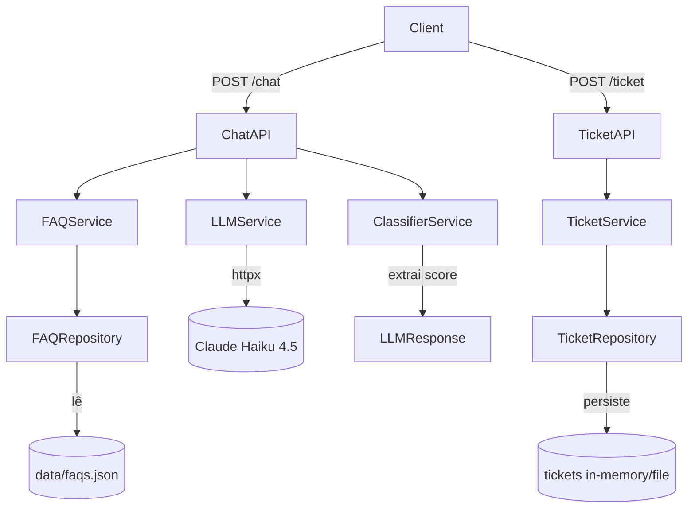

# Design Técnico: SupportBot FAQ

## Overview

O SupportBot FAQ é uma API REST que recebe perguntas em linguagem natural de clientes da TechStore, consulta uma base de FAQs, gera respostas via LLM (Claude Haiku 4.5) e avalia a confiança da resposta. Quando a confiança está abaixo do threshold configurado, o sistema instrui o cliente a fornecer seus dados e abre um ticket para atendimento humano.

O fluxo principal é:
1. Cliente envia pergunta → `POST /chat`
2. FAQ_Service busca a FAQ mais relevante
3. LLM_Service gera resposta baseada na FAQ
4. Classifier_Service calcula o Confidence_Score
5. Se score ≥ threshold → retorna resposta diretamente
6. Se score < threshold → instrui cliente a abrir ticket via `POST /ticket`

## Architecture



### Camadas

| Camada | Responsabilidade |
|---|---|
| `api/` | Receber requisições HTTP, validar entrada via Pydantic, retornar respostas |
| `services/` | Orquestrar regras de negócio (FAQ lookup, geração de resposta, classificação, ticket) |
| `repositories/` | Carregar FAQs do JSON, persistir tickets |
| `models/` | Schemas Pydantic para request/response e entidades internas |
| `prompts/` | Templates de prompt para o LLM |
| `utils/` | Logger estruturado JSON, validadores auxiliares |

## Components and Interfaces

### Chat API (`app/api/routes_chat.py`)

```python
POST /chat
  Request:  ChatRequest(message: str)
  Response: ChatResponse(answer: str, confidence: float, escalated: bool)
  Errors:   422 (mensagem vazia), 503 (LLM indisponível), 500 (erro interno)
```

### Ticket API (`app/api/routes_ticket.py`)

```python
POST /ticket
  Request:  TicketRequest(name: str, email: EmailStr, description: str)
  Response: TicketResponse(ticket_id: str, message: str)
  Errors:   422 (campos inválidos/ausentes), 500 (erro interno)
```

### FAQ Service (`app/services/faq_service.py`)

```python
def find_relevant_faq(message: str, faqs: list[FAQ]) -> FAQ | None
```

Responsável por identificar a FAQ mais relevante para a mensagem do cliente. Estratégia inicial: matching por palavras-chave/similaridade simples. Retorna `None` se nenhuma FAQ for suficientemente relevante.

### LLM Service (`app/services/llm_service.py`)

```python
async def generate_response(message: str, faq: FAQ | None) -> LLMResult
# LLMResult(answer: str, raw_response: dict)
```

Encapsula toda comunicação com Claude Haiku 4.5 via `httpx`. Usa `system_prompt.txt` quando há FAQ relevante e `fallback_prompt.txt` quando não há. Lança `LLMUnavailableError` em caso de falha de conectividade.

### Classifier Service (`app/services/classifier_service.py`)

```python
def calculate_confidence(llm_result: LLMResult) -> float
```

Extrai o Confidence_Score da resposta do LLM. O LLM é instruído via prompt a incluir um campo de confiança na resposta estruturada. O score é normalizado para o intervalo [0.0, 1.0].

### Ticket Service (`app/services/ticket_service.py`)

```python
def create_ticket(name: str, email: str, description: str) -> Ticket
```

Cria e persiste um ticket via `TicketRepository`. Retorna o `Ticket` com `ticket_id` gerado.

### FAQ Repository (`app/repositories/faq_repository.py`)

```python
def load_faqs(path: str) -> list[FAQ]
```

Carrega e valida o arquivo `data/faqs.json` na inicialização. Lança `FileNotFoundError` ou `json.JSONDecodeError` em caso de falha, que são capturados em `main.py` para encerrar com código de saída diferente de zero.

### Ticket Repository (`app/repositories/ticket_repository.py`)

```python
def save_ticket(ticket: Ticket) -> str  # retorna ticket_id
def get_ticket(ticket_id: str) -> Ticket | None
```

Persistência inicial em memória (dict). Estrutura facilmente substituível por banco de dados.

### Config (`app/config.py`)

```python
class Settings(BaseSettings):
    confidence_threshold: float = 0.7
    anthropic_api_key: str
    faqs_path: str = "data/faqs.json"
    log_level: str = "INFO"
```

Carregado via `python-dotenv` / `pydantic-settings`.

## Data Models

### FAQ (`app/models/faq.py`)

```python
class FAQ(BaseModel):
    id: str
    category: str          # "entrega" | "troca" | "pagamento" | "pedido"
    question: str
    answer: str
    keywords: list[str]
```

### Message (`app/models/message.py`)

```python
class ChatRequest(BaseModel):
    message: str = Field(..., min_length=1)

class ChatResponse(BaseModel):
    answer: str
    confidence: float      # [0.0, 1.0]
    escalated: bool        # True quando confidence < threshold
```

### Ticket (`app/models/ticket.py`)

```python
class TicketRequest(BaseModel):
    name: str = Field(..., min_length=1)
    email: EmailStr
    description: str = Field(..., min_length=1)

class Ticket(BaseModel):
    ticket_id: str
    name: str
    email: str
    description: str
    created_at: datetime

class TicketResponse(BaseModel):
    ticket_id: str
    message: str
```

### Estrutura do `data/faqs.json`

```json
[
  {
    "id": "faq-001",
    "category": "entrega",
    "question": "Qual o prazo de entrega?",
    "answer": "O prazo padrão é de 5 a 10 dias úteis...",
    "keywords": ["prazo", "entrega", "quando", "chega"]
  }
]
```

### LLM Prompt Structure

O LLM é instruído a retornar JSON estruturado:

```json
{
  "answer": "Texto da resposta ao cliente",
  "confidence": 0.85
}
```

Isso permite que o `ClassifierService` extraia o score diretamente da resposta, sem heurísticas externas.


## Correctness Properties

*A property is a characteristic or behavior that should hold true across all valid executions of a system — essentially, a formal statement about what the system should do. Properties serve as the bridge between human-readable specifications and machine-verifiable correctness guarantees.*

### Property 1: Resposta do chat contém campos obrigatórios com valores válidos

*Para qualquer* mensagem válida (não vazia, não apenas whitespace) enviada ao endpoint `/chat`, a resposta deve sempre conter o campo `answer` (string não vazia) e o campo `confidence` (float no intervalo [0.0, 1.0]).

**Validates: Requirements 1.4, 2.1**

---

### Property 2: Mensagens compostas apenas de whitespace são rejeitadas

*Para qualquer* string composta inteiramente de caracteres whitespace (espaços, tabs, newlines) ou string vazia, o endpoint `/chat` deve retornar status HTTP 422.

**Validates: Requirements 1.5**

---

### Property 3: Confidence_Score determina escalation de forma consistente

*Para qualquer* par (confidence_score, confidence_threshold), se `confidence_score >= confidence_threshold` então `escalated` deve ser `False`; se `confidence_score < confidence_threshold` então `escalated` deve ser `True`. Essa relação deve ser invariante para todos os valores válidos de score e threshold no intervalo [0.0, 1.0].

**Validates: Requirements 2.2, 2.3**

---

### Property 4: FAQ_Service retorna apenas FAQs da lista fornecida

*Para qualquer* mensagem e *para qualquer* lista de FAQs, o resultado de `find_relevant_faq` deve ser `None` ou um elemento que pertence à lista de FAQs fornecida como entrada. O serviço nunca deve retornar uma FAQ que não esteja na base consultada.

**Validates: Requirements 1.2**

---

### Property 5: Tickets criados possuem identificadores únicos

*Para qualquer* sequência de N tickets criados com dados válidos (N ≥ 2), todos os `ticket_id` retornados devem ser distintos entre si. A unicidade deve ser garantida independentemente do conteúdo dos tickets.

**Validates: Requirements 3.3**

---

### Property 6: Criação de ticket válido retorna estrutura completa

*Para qualquer* `TicketRequest` válido (name não vazio, email válido, description não vazia), a resposta do endpoint `/ticket` deve ter status HTTP 201 e conter `ticket_id` (string não vazia) e `message` (string não vazia).

**Validates: Requirements 3.4**

---

### Property 7: Campos obrigatórios do ticket rejeitam whitespace

*Para qualquer* `TicketRequest` onde `name` ou `description` seja composto apenas de whitespace (ou ausente), o endpoint `/ticket` deve retornar status HTTP 422. Da mesma forma, *para qualquer* string que não seja um endereço de e-mail válido no campo `email`, o endpoint deve retornar status HTTP 422.

**Validates: Requirements 3.5, 3.6, 3.7**

---

### Property 8: Round-trip de serialização de FAQ preserva dados

*Para qualquer* objeto `FAQ` válido, serializar via `model_dump()` e desserializar via `model_validate()` deve produzir um objeto equivalente ao original — todos os campos devem ter os mesmos valores após o ciclo de serialização/desserialização.

**Validates: Requirements 4.5**

---

### Property 9: Logs estruturados contêm campos obrigatórios

*Para qualquer* evento registrado pelo logger do SupportBot, o output deve ser JSON válido contendo os campos `timestamp`, `level`, `service` e `message`. Essa estrutura deve ser mantida independentemente do tipo de evento ou serviço que originou o log.

**Validates: Requirements 5.4**

---

## Error Handling

| Cenário | Comportamento |
|---|---|
| Mensagem vazia ou whitespace | Pydantic valida via `min_length=1`; FastAPI retorna 422 automaticamente |
| LLM indisponível (timeout/conexão) | `LLMService` lança `LLMUnavailableError`; handler global retorna 503 |
| `data/faqs.json` não encontrado | `FileNotFoundError` capturado em `main.py`; log de erro + `sys.exit(1)` |
| JSON inválido em `faqs.json` | `json.JSONDecodeError` capturado em `main.py`; log descritivo + `sys.exit(1)` |
| Campo `email` inválido | Pydantic `EmailStr` valida; FastAPI retorna 422 automaticamente |
| Campos `name`/`description` vazios | Pydantic `min_length=1` valida; FastAPI retorna 422 automaticamente |
| Exceção não tratada em qualquer serviço | Handler global em `main.py` captura, loga stack trace, retorna 500 |
| Confidence_Score fora de [0.0, 1.0] | `ClassifierService` normaliza via `max(0.0, min(1.0, raw_score))` |

### Exception Hierarchy

```
SupportBotError (base)
├── LLMUnavailableError      # LLM inacessível
├── FAQLoadError             # Falha ao carregar faqs.json
└── TicketPersistenceError   # Falha ao persistir ticket
```

## Testing Strategy

### Abordagem dual: testes de exemplo + testes de propriedade

**Testes de exemplo** (`tests/test_chat.py`, `tests/test_faq_service.py`, `tests/test_ticket_service.py`):
- Caminho feliz: mensagem válida → resposta com answer e confidence
- Fallback: LLM indisponível → 503
- Escalation: score baixo → escalated=True com instrução ao cliente
- Criação de ticket: dados válidos → 201 com ticket_id
- Inicialização: arquivo JSON ausente/inválido → sys.exit(1)
- Logging: verificar campos obrigatórios nos logs via mock

**Testes de propriedade** com `hypothesis` (biblioteca PBT para Python):
- Mínimo de 100 iterações por propriedade (padrão do Hypothesis)
- Cada teste referencia a propriedade do design via comentário no formato:
  `# Feature: supportbot-faq, Property N: <texto da propriedade>`

| Propriedade | Estratégia Hypothesis |
|---|---|
| Property 1 | `st.text(min_size=1).filter(lambda s: s.strip())` para mensagens |
| Property 2 | `st.text(alphabet=st.characters(whitelist_categories=('Zs',)))` |
| Property 3 | `st.floats(0.0, 1.0)` para score e threshold |
| Property 4 | `st.lists(st.builds(FAQ, ...))` + `st.text()` para mensagem |
| Property 5 | `st.lists(st.builds(TicketRequest, ...), min_size=2)` |
| Property 6 | `st.builds(TicketRequest, ...)` com dados válidos |
| Property 7 | `st.text(alphabet=st.characters(whitelist_categories=('Zs',)))` para campos |
| Property 8 | `st.builds(FAQ, ...)` com campos aleatórios válidos |
| Property 9 | Gerar eventos de log aleatórios e verificar estrutura JSON |

**Isolamento do LLM**: todos os testes usam `unittest.mock.patch` ou `pytest-mock` para substituir o `LLMService`. Nenhum teste deve fazer chamadas reais à API do Claude.

**Cobertura mínima esperada**:
- Caminho feliz (score ≥ threshold) ✓
- Caminho de escalation (score < threshold) ✓
- Todos os casos de validação 422 ✓
- Falha de LLM → 503 ✓
- Falha de inicialização → sys.exit(1) ✓
- Round-trip de serialização de FAQ ✓
